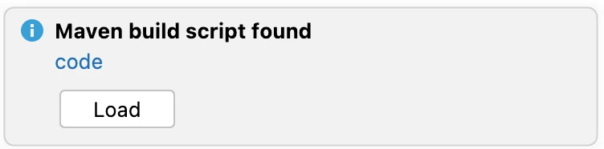
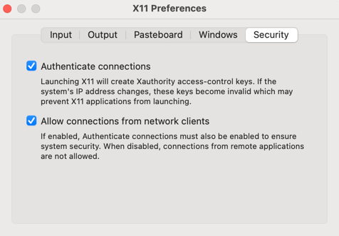

# DD Photos Desktop Application Developer Notes

## Introduction

Welcome to the DD Photos Desktop Application source code. This page tells you (hopefully)
everything you need to know to run the DD Photos app.

## Mac vs. Linux vs. Windows (a note from Doug)

These instructions are admittedly Mac-centric, largely because that is what I have used
for the last 15 years.  I've done cursory testing on Linux (see Appendix A for testing tips
on Ubuntu from Docker/Mac).

I haven't used Windows for development in a very long time, so apologies to Windows developers 
for the lack of instructions. Cygwin worked back in the day, and I imagine that the Windows Subsystem for Linux (WSL)
should be helpful here, too.

Feel free to submit a PR with any changes to these docs that would help Linux or Windows users.

## Prerequisites

Required software:

* Java 25 - [See Adoptium](https://adoptium.net/temurin/releases/?os=any&package=jdk&version=25)
* Maven 3 - [See Apache Maven](https://maven.apache.org/install.html)
* Docker - [See Docker](https://docs.docker.com/engine/install/)

Both `java` and `mvn` must be on your `PATH`.

We provide the `ddphotos.rc` file, which sets some environment variables required by the scripts in
`tools/bin` and `tools/db`, adds these script directories to the `PATH`, creates some useful
`mvn` aliases (used below) and performs some sanity checks.

**NOTE**: all commands below assume you have sourced `ddphotos.rc`, have `mvn` and `java` installed and that
you are in the root of this repository.

```shell
source ddphotos.rc
```

## Mac Installs

[Brew](https://brew.sh/) is useful to install Java and Maven:

```shell
brew install temurin@25 maven
```

## Compile Code

To compile the code and create the `.jar` and `.war` files,
use maven.  This version skips the tests, which you can
run separately (see below).

```shell
mvn-package-notests
```

After you have run this, any of the scripts discussed below should just work.

## DD Photos

To run the desktop tool, either run `PhotosMain` in IntelliJ or use the script:

```shell
ddphotos-app
```

## Development

IntelliJ can be used to run the programs described below.  If you open up the
root of this project in IntelliJ, it should auto-detect
the `code/pom.xml` file and prompt you to load it:



**NOTE**: You will probably need to edit the Project Structure to tell IntelliJ to use Java 25.
Go to _File → Project Structure... → Project Settings → Project → SDK_ and
set to Java 25 (you may need to add it (_+ Add SDK_) as a new SDK if not already there).

## Run Tests

To build code and run unit tests, use `mvn-test`.

```shell
mvn-test
```

## Code Notes

This section is meant to help developers understand the code base, and it contains random
bits of knowledge and advice.

### Modules

Here is a brief overview of the modules in this repo, in the order maven builds them, which
means the later modules are dependent on one or more of the earlier modules.

* `common` - core functionality including configuration, logging, xml, properties, various utils
* `gui` - GUI infrastructure extending Java Swing
* `engine` - core app engine and utilities
* `photos` - DD Photos application
* `installer` - custom installer logic (e.g., cleanup)

### Properties Files

Properties files are used for two primary purposes

* `log4j2.*.properties` - `LoggingConfig` - configure logging
* `*.properties` - `PropertyConfig` - configure application behavior, various settings, localizable text

One key tenet we adhered to at Donohoe Digital was to avoid making "temporary" changes
to `.properties` files for personal use (e.g., development, debugging or testing).
Instead, settings could be overridden using user-specific files.  These could be
checked into the tree and not impact production code.  This is why you see properties
files with `donohoe` in the name.

Here's roughly how the two versions work:

#### LoggingConfig (log4j)

Based on "application type", our config looks for:

* Client - `log4j2.client.properties`
* Command Line + Unit Tests - `log4j2.cmdline.properties`

It looks for and loads these files on the classpath in this order:

* `config/common/log4j2.[apptype].properties` - default settings for `apptype`
* `config/[appname]/log4j2.[apptype].properties` - override default settings for application named `appname`
* `config/override/[username].log4j2.properties` - overrides all types for `username`
* `config/override/[username].log4j2.[apptype].properties` - overrides for just `apptype` for `username`

The latter files override any settings in the earlier files.  In log4j, this is commonly used
to turn on logging to the console or to change the logging level for a particular library.

#### PropertyConfig

Similar to logging config, each `apptype` has its own properties file, which are loaded in this order:

* `config/[appname]/common.properties` - properties for application named `appname`, shared across all types
* `config/[appname]/[apptype].properties.[locale]` - properties for `apptype` for `appname` for given locale
* `config/[appname]/[apptype].properties` - properties for `apptype` for `appname` (if no locale provided)
* `config/[appname]/override/[username].properties` - overrides for `appname` for `username`

The user-specific overrides were commonly used to enable debug/testing settings.

There aren't any locale-specific settings, but it was successfully used in the past to localize into
another language.

### Debug Settings

There are lots of `settings.debug.*` entries in the code which are used to make
development easier.  Typically, you put these in your `[username].properties` file,
so they only are used by you.

Here are a few interesting ones

```properties
# Enable debug flags
settings.debug.enabled=true

# use local 'ddphotos' image
settings.debug.local.image=true
```

There are many other examples, just take a look in the code for `settings.debug` to
find the constants and then find usages of those constants.

### Installers

An alternative to using the installers found in [Releases](https://github.com/dougdonohoe/ddphotos-app/releases)
is to distribute an all-in-one `.jar` file by doing this:

```shell
mvn-install-notests
cd code/photos
mvn package assembly:single -DskipTests=true
```

This creates a `photos-1.0-jar-with-dependencies.jar` in the `target` directory.  You can then
distribute this `.jar` file and run it like so:

```shell
java --enable-native-access=ALL-UNNAMED -jar target/photos-1.0-jar-with-dependencies.jar
```

For Mac users, if you also distribute the `logo/icons/ddphotos-logo/ddphotos-logo.icns` file,
you can get a dock icon:

```shell
java -Xdock:icon=ddphotos-logo.icns --enable-native-access=ALL-UNNAMED -jar photos-1.0-jar-with-dependencies.jar
```

### Preferences

Preferences set in the app are saved using Java Preferences API, which on a Mac can be found
in `com.donohoedigital.ddphotos1.plist`.  To view the contents of this file:

```shell
cd ~/Library/Preferences
plutil -convert xml1 com.donohoedigital.ddphotos1.plist -o -
```

Default values for items are set in
`code/photos/src/main/resources/config/ddphotos/client.properties`, and actual values
set by the user are stored in the `.plist` file.

You can clear all preferences via the `File -> Reset Preferences` menu item.
If you want to completely all preferences, on a Mac, you need to delete the `.plist` file
**AND** restart the `cfprefsd` service, which can keep preferences values in
memory.

```shell
cd ~/Library/Preferences
rm -f com.donohoedigital.ddphotos1.plist
killall -u $USER cfprefsd
```

### Classpath and Dependency Tree

We override the `mvn dependency:tree` to create `target/classpath.txt` in each module, which
is used by the `runjava` and `buildall.pl` scripts to determine the jar files needed to
run a program.

To get the default tree output, to diagnose dependency issues, run this in `code` or in a particular
module, like `code/photos`.

```shell
# Need to "install" to get proper trees when doing it in sub-tree (for reasons I'm not clear on)
mvn-install-no-tests

# cd to a module
cd code/photos

# output to console, with other maven INFO
mvn dependency:tree -Ddependency.classpath.outputFile=

# just the tree
mvn dependency:tree -q -Dscope=runtime -Ddependency.classpath.outputFile=/tmp/t && cat /tmp/t && rm -f /tmp/t

# ddphotos.rc has alias for this previous one
mvn-tree
```

## Appendix A: Testing on Ubuntu via Docker

It is possible to run DD Photos in Ubuntu in Docker and display it on your Mac, but
it can be a little finicky.  Here's what I got to work with help from
[this helpful gist](https://gist.github.com/cschiewek/246a244ba23da8b9f0e7b11a68bf3285).

First Install XQuartz from [www.xquartz.org](https://www.xquartz.org/) and then launch it from `Applications` or
from the command line:

```shell
open -a XQuartz
```

Next, got to _XQuartz → Settings → Security_ and ensure **Allow connections
from network clients** is checked.



Then logout and log back in to ensure these settings are in effect (a reboot
may also be necessary).

Next, follow these steps:

```shell
# Start XQuartz again
open -a XQuartz

# Tell X to allow connections
xhost + localhost

# Build docker image
docker build -f Dockerfile.ubuntu.docker -t ddphotosubuntu .

# Run it, mapping ddphotos-app dir and maven .m2-ubuntu dir to the image
docker run -it --rm -v $(pwd):$(pwd) -v $HOME/.m2-ubuntu:/root/.m2 \
  -w $(pwd) -e DISPLAY=host.docker.internal:0 ddphotosubuntu
  
# Or to test installer in builds dir
docker run -it --rm -v $(pwd):$(pwd) -w $(pwd) -e DISPLAY=host.docker.internal:0 ddphotosubuntu
sh ./ddphotos1_.sh
```

You can test X is working by running `xeyes`.  It should display the iconic X app that
follows your cursor with big oval eyes.  If you encounter problems, the gist mentioned above
has good troubleshooting tips.

Next, you should be able to build and run `ddphotos-app` from the Ubuntu container:

```shell
source ddphotos.rc
mvn-package-notests
ddphotos-app
```

## Appendix B: Running GitHub Actions Locally

You can run GitHub actions locally using the [`act`](https://nektosact.com/) tool (which requires Docker).

To install `act`:

```shell
brew install act
```

The `act-ddphotos-app` alias uses a custom Docker image you need to build once:

```shell
docker build -t ddphotos-act-runner -f Dockerfile.act .
```

To run the GitHub testing action locally, just use the alias:

```shell
act-ddphotos-app
```
