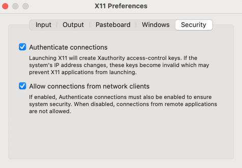

# DD Photos Desktop App Developer Notes

## Introduction

Welcome to the DD Photos Desktop Application source code. This page tells you (hopefully)
everything you need to know to run the DD Photos app.

Development happens on **Mac, Linux, or Windows via WSL2** - all three are the same Unix
environment as far as this repo is concerned, so there is one set of instructions below.

Windows developers should use [WSL2](#windows-via-wsl2).  Running the build natively on
Windows (PowerShell, no WSL) is possible and is covered in
[Appendix E](#appendix-e-native-windows-and-powershell), but it is a secondary path used
mainly for testing how the app behaves for Windows users - not a fully supported
development environment.

## Prerequisites

Required software:

* Java 25 - [See Adoptium↗](https://adoptium.net/temurin/releases/?os=any&package=jdk&version=25)
* Maven 3 - [See Apache Maven↗](https://maven.apache.org/install.html)
* Docker - [See Docker↗](https://docs.docker.com/engine/install/)

Both `java` and `mvn` must be on your `PATH`.

We provide the `ddphotos.rc` file, which sets some environment variables required by the scripts in
`tools/bin` and adds these script directories to the `PATH`, creates some useful
`mvn` aliases (used below) and performs some sanity checks.

**NOTE**: all commands below assume you have sourced `ddphotos.rc`, have `mvn` and `java` installed and that
you are in the root of this repository.

```shell
source ddphotos.rc
```

## Platform Setup

### Mac

[Brew↗](https://brew.sh/) is useful to install Java and Maven:

```shell
brew install temurin@25 maven
```

### Linux (Ubuntu/Debian)

Ubuntu's own repositories lag behind on JDK versions, so install Java 25 from the
[Adoptium apt repository↗](https://adoptium.net/installation/linux/):

```shell
sudo apt install -y wget apt-transport-https gpg

wget -qO - https://packages.adoptium.net/artifactory/api/gpg/key/public \
  | gpg --dearmor | sudo tee /usr/share/keyrings/adoptium.gpg > /dev/null

echo "deb [signed-by=/usr/share/keyrings/adoptium.gpg] https://packages.adoptium.net/artifactory/deb \
$(awk -F= '/^VERSION_CODENAME/{print$2}' /etc/os-release) main" \
  | sudo tee /etc/apt/sources.list.d/adoptium.list

sudo apt update
sudo apt install -y temurin-25-jdk maven
```

For Docker on Linux, either Docker Desktop or just the Docker Engine will do.

### Windows via WSL2

[WSL2↗](https://learn.microsoft.com/en-us/windows/wsl/install) runs a real Ubuntu on your
Windows machine, which makes Windows development identical to Linux development - same
shell, same scripts, same commands as the rest of this document.  Modern WSL includes
**WSLg**, so DD Photos opens as an ordinary window on your Windows desktop with no X
server to configure.

From PowerShell, install WSL and Ubuntu:

```powershell
wsl --install -d Ubuntu
```

Reboot if prompted, then open the Ubuntu terminal and follow the
[Linux (Ubuntu/Debian)](#linux-ubuntudebian) instructions above to install Java and Maven.

Two Windows-side details:

* Install [Docker Desktop↗](https://www.docker.com/products/docker-desktop/) on **Windows**,
  not inside WSL.  Then, in **Settings → Resources → WSL Integration**, enable integration
  for your Ubuntu distro so the `docker` command works inside WSL.
* **Clone the repo into the WSL filesystem** (e.g. `~/work/ddphotos-app`), not under
  `/mnt/c`.  Reaching the Windows drive from WSL goes over a slow filesystem bridge - the
  same warm build took **64s** from `/mnt/c` versus **2.4s** from `~/work`.  Windows tools
  can still reach the WSL copy via `\\wsl$\Ubuntu\home\<user>\work` if needed.

Verify WSLg is working with `echo $DISPLAY` (it should print something like `:0`).

## Build and Run

Run these **from the root of this repository**.  The Maven reactor lives in `code/`, which
is why each command passes `-f code/pom.xml`.

```shell
# build, skipping tests
mvn -f code/pom.xml package -DskipTests=true

# build and run the unit tests
mvn -f code/pom.xml test -Dskip.unit.tests=false
```

Unit tests are skipped by default, which is why running them takes
`-Dskip.unit.tests=false` rather than just `test`.

### Running DD Photos

Running the app takes two steps.  First install the modules it depends on into your local
Maven repository:

```shell
mvn -f code/pom.xml install -DskipTests=true -pl .,common,gui,engine,photos
```

Then launch it:

```shell
mvn -f code/pom.xml -pl photos exec:exec
```

The `exec:exec` goal is configured in `code/photos/pom.xml` and launches
`com.donohoedigital.ddphotos.PhotosMain` with the same JVM options the `ddphotos-app`
script uses.

A few notes:

* The leading `.` in `-pl .,common,gui,engine,photos` is the parent `all` POM.  Leave it
  out and the build fails with *"Could not find artifact com.donohoedigital:all:pom:1.0"*,
  because `photos` cannot resolve its parent.
* `exec:exec` does not compile anything.  It runs `photos` from
  `code/photos/target/classes` but picks up `common`, `gui` and `engine` as jars from your
  local Maven repository.  So after editing `photos` you need a `package` first, and after
  editing any of the other three you need to re-run the `install` above.
* `installer` and `zydeco` are left out on purpose: `installer` is only used when building
  the Install4j installer, and `zydeco` is an experimental scratch module.
* Under WSL2, the window opens on your Windows desktop via WSLg - nothing else to set up.

### Shell script shortcuts

`ddphotos.rc` defines shorter aliases for the above and puts `tools/bin` on your `PATH`:

```shell
source ddphotos.rc

mvn-package-notests   # build, skipping tests
mvn-test              # build and run unit tests
ddphotos-app          # run the app
```

Sourcing the file also runs some sanity checks on your Java and Maven versions.

## Development

IntelliJ can be used to run the programs described below.  If you open up the
root of this project in IntelliJ, it should auto-detect
the `code/pom.xml` file and prompt you to load it:


**NOTE**: You will probably need to edit the Project Structure to tell IntelliJ to use Java 25.
Go to _File → Project Structure... → Project Settings → Project → SDK_ and
set to Java 25 (you may need to add it (_+ Add SDK_) as a new SDK if not already there).

To run the app from the IDE, run `PhotosMain` directly.

**NOTE**: add `--enable-native-access=ALL-UNNAMED` to the *VM options* of the run
configuration.  Without it, the first time a dialog opens, Java 25 prints:

```
WARNING: A restricted method in java.lang.System has been called
WARNING: java.lang.System::load has been called by com.formdev.flatlaf.util.NativeLibrary in an unnamed module (file:/C:/Users/xboxl/.m2/repository/com/formdev/flatlaf/3.7.2/flatlaf-3.7.2.jar)
WARNING: Use --enable-native-access=ALL-UNNAMED to avoid a warning for callers in this module
WARNING: Restricted methods will be blocked in a future release unless native access is enabled
```

FlatLaf loads a native library the first time it puts up a dialog, which is why the warning
appears then rather than at startup.  The `runjava` script and the `exec:exec` goal already
pass this flag, so IntelliJ run configurations are the only place it needs setting by hand.

On Windows, use IntelliJ's
[WSL support↗](https://www.jetbrains.com/help/idea/how-to-use-wsl-development-environment-in-product.html)
to open the checkout living inside WSL (`\\wsl$\Ubuntu\...`).

## Code Notes

This section is meant to help developers understand the code base, and it contains random
bits of knowledge and advice.

### Modules

Here is a brief overview of the modules in this repo, in the order maven builds them, which
means the later modules are dependent on one or more of the earlier modules.

* `common` - core functionality including configuration, logging, XML, properties, various utils
* `gui` - GUI infrastructure extending Java Swing
* `installer` - custom installer logic (e.g., cleanup); only used when building the Install4j installer
* `engine` - core app engine and utilities
* `photos` - DD Photos application
* `zydeco` - experimental scratch module, not part of the app

The four that matter for building and running DD Photos are `common`, `gui`, `engine` and
`photos`, which is why they are the ones listed in the `-pl` commands above.

### Properties Files

Properties files are used for two primary purposes

* `log4j2.*.properties` - `LoggingConfig` - configure logging
* `*.properties` - `PropertyConfig` - configure application behavior, various settings, localizable text

One key tenet we adhered to at Donohoe Digital was to avoid making "temporary" changes
to `.properties` files for personal use (e.g., development, debugging or testing).
Instead, settings could be overridden using user-specific files.  These could be
checked into the tree and not impact production code.  This is why you see properties
files with `donohoe` in the name.

Here's roughly how the two versions work:

#### LoggingConfig (log4j)

Based on "application type", our config looks for:

* Client - `log4j2.client.properties`
* Command Line + Unit Tests - `log4j2.cmdline.properties`

It looks for and loads these files on the classpath in this order:

* `config/common/log4j2.[apptype].properties` - default settings for `apptype`
* `config/[appname]/log4j2.[apptype].properties` - override default settings for application named `appname`
* `config/override/[username].log4j2.properties` - overrides all types for `username`
* `config/override/[username].log4j2.[apptype].properties` - overrides for just `apptype` for `username`

The latter files override any settings in the earlier files.  In log4j, this is commonly used
to turn on logging to the console or to change the logging level for a particular library.

#### PropertyConfig

Similar to logging config, each `apptype` has its own properties file, which are loaded in this order:

* `config/[appname]/common.properties` - properties for application named `appname`, shared across all types
* `config/[appname]/[apptype].properties.[locale]` - properties for `apptype` for `appname` for given locale
* `config/[appname]/[apptype].properties` - properties for `apptype` for `appname` (if no locale provided)
* `config/[appname]/override/[username].properties` - overrides for `appname` for `username`

The user-specific overrides were commonly used to enable debug/testing settings.

There aren't any locale-specific settings, but it was successfully used in the past to localize into
another language.

### Debug Settings

There are lots of `settings.debug.*` entries in the code which are used to make
development easier.  Typically, you put these in your `[username].properties` file,
so they only are used by you.

Here are a few interesting ones

```properties
# Enable debug flags
settings.debug.enabled=true

# use local 'ddphotos' image
settings.debug.local.image=true
```

There are many other examples, just take a look in the code for `settings.debug` to
find the constants and then find usages of those constants.

### Installers

An alternative to using the installers found in [Releases](https://github.com/dougdonohoe/ddphotos-app/releases)
is to distribute an all-in-one `.jar` file by doing this:

```shell
mvn -f code/pom.xml install -DskipTests=true
mvn -f code/photos/pom.xml package assembly:single -DskipTests=true
```

This creates a `photos-1.0-jar-with-dependencies.jar` in the `target` directory.  You can then
distribute this `.jar` file and run it like so:

```shell
java --enable-native-access=ALL-UNNAMED -jar code/photos/target/photos-1.0-jar-with-dependencies.jar
```

For Mac users, if you also distribute the `logo/icons/ddphotos-logo/ddphotos-logo.icns` file,
you can get a dock icon:

```shell
java -Xdock:icon=logo/icons/ddphotos-logo/ddphotos-logo.icns --enable-native-access=ALL-UNNAMED -jar code/photos/target/photos-1.0-jar-with-dependencies.jar
```

### Preferences

Preferences set in the app are saved using the Java Preferences API, under the
`com/donohoedigital/ddphotos1` node.  Where that actually lives is up to the JDK and
differs per platform:

| Platform    | Location                                                                         |
|-------------|----------------------------------------------------------------------------------|
| Mac         | `~/Library/Preferences/com.donohoedigital.ddphotos1.plist`                       |
| Linux / WSL | `~/.java/.userPrefs/com/donohoedigital/ddphotos1/` (a tree of `prefs.xml` files) |
| Windows     | Registry key `HKCU\Software\JavaSoft\Prefs\com\donohoedigital\ddphotos1`         |

Default values for items are set in
`code/photos/src/main/resources/config/ddphotos/client.properties`; actual values set by
the user are stored in the platform location above.

To view the current contents:

```shell
# Mac
plutil -convert xml1 ~/Library/Preferences/com.donohoedigital.ddphotos1.plist -o -

# Linux / WSL
cat ~/.java/.userPrefs/com/donohoedigital/ddphotos1/prefs.xml
```

```powershell
# Windows
Get-ChildItem -Recurse 'HKCU:\Software\JavaSoft\Prefs\com\donohoedigital\ddphotos1'
```

Note that on Linux and Windows the node names are escaped by the JDK (mixed-case names get
encoded), so some of the directory and key names look like line noise.  That is expected.

You can clear all preferences via the `File -> Reset Preferences` menu item.  To remove
them completely:

```shell
# Mac - must also restart cfprefsd, which caches preferences in memory
cd ~/Library/Preferences
rm -f com.donohoedigital.ddphotos1.plist
killall -u $USER cfprefsd

# Linux / WSL
rm -rf ~/.java/.userPrefs/com/donohoedigital/ddphotos1
```

```powershell
# Windows
Remove-Item -Recurse 'HKCU:\Software\JavaSoft\Prefs\com\donohoedigital\ddphotos1'
```

### Classpath and Dependency Tree

We override the `mvn dependency:tree` to create `target/classpath.txt` in each module, which
is used by the `runjava` and `buildall.pl` scripts to determine the jar files needed to
run a program.

To get the default tree output, to diagnose dependency issues, run this in `code` or in a particular
module, like `code/photos`.

```shell
# Need to "install" to get proper trees when doing it in sub-tree (for reasons I'm not clear on)
mvn -f code/pom.xml install -DskipTests=true

# cd to a module
cd code/photos

# output to console, with other maven INFO
mvn dependency:tree -Ddependency.classpath.outputFile=

# just the tree
mvn dependency:tree -q -Dscope=runtime -Ddependency.classpath.outputFile=/tmp/t && cat /tmp/t && rm -f /tmp/t

# ddphotos.rc has alias for this previous one
mvn-tree
```

## Appendix A: Testing on Ubuntu via Docker

It is possible to run DD Photos in Ubuntu in Docker and display it on your Mac, but
it can be a little finicky.  Here's what I got to work with help from
[this helpful gist↗](https://gist.github.com/cschiewek/246a244ba23da8b9f0e7b11a68bf3285).

First Install XQuartz from [www.xquartz.org↗](https://www.xquartz.org/) and then launch it from `Applications` or
from the command line:

```shell
open -a XQuartz
```

Next, got to _XQuartz → Settings → Security_ and ensure **Allow connections
from network clients** is checked.



Then logout and log back in to ensure these settings are in effect (a reboot
may also be necessary).

Next, follow these steps:

```shell
# Start XQuartz again
open -a XQuartz

# Tell X to allow connections
xhost + localhost

# Build docker image
docker build -f Dockerfile.ubuntu.docker -t ddphotosubuntu .

# Run it, mapping ddphotos-app dir and maven .m2-ubuntu dir to the image
docker run -it --rm -v $(pwd):$(pwd) -v $HOME/.m2-ubuntu:/root/.m2 \
  -w $(pwd) -e DISPLAY=host.docker.internal:0 ddphotosubuntu
  
# Or to test installer in builds dir
docker run -it --rm -v $(pwd):$(pwd) -w $(pwd) -e DISPLAY=host.docker.internal:0 ddphotosubuntu
sh ./ddphotos_linux_*.sh
```

You can test X is working by running `xeyes`.  It should display the iconic X app that
follows your cursor with big oval eyes.  If you encounter problems, the gist mentioned above
has good troubleshooting tips.

Next, you should be able to build and run `ddphotos-app` from the Ubuntu container:

```shell
source ddphotos.rc
mvn-package-notests
ddphotos-app
```

## Appendix B: Running GitHub Actions Locally

You can run GitHub actions locally using the [act↗](https://nektosact.com/) tool (which requires Docker).

To install `act`:

```shell
# Mac
brew install act

# Linux / WSL - there is no apt package
curl --proto '=https' --tlsv1.2 -sSf https://raw.githubusercontent.com/nektos/act/master/install.sh \
  | sudo bash -s -- -b /usr/local/bin
```

The `act-ddphotos-app` alias uses a custom Docker image you need to build once:

```shell
docker build -t ddphotos-act-runner -f Dockerfile.act .
```

To run the GitHub testing action locally, just use the alias:

```shell
act-ddphotos-app
```

## Appendix C: Icons and Screenshots

### Screenshots

The screenshots in `images/screenshots` are captured from the running app, so they have
to be re-taken by hand whenever the UI changes.

Capturing is a debug feature, enabled with these settings in your
`[username].properties` file (see [Debug Settings](#debug-settings)):

```properties
# debug flags must be on for the menu item to appear
settings.debug.enabled=true

# turn on screenshot menu item
settings.debug.screenshots=true
settings.debug.screenshots.path=/Users/donohoe/work/ddphotos-app/images/screenshots
settings.debug.screenshots.shadow=true
```

With those set, _Help → Take screenshot..._ (or `Cmd-R`) captures the current window to
`settings.debug.screenshots.path`.  The filename is chosen automatically from what is
showing: the current step when the startup wizard is up (e.g. `wizard-docker.png`),
otherwise the selected tab in the main screen (e.g. `config.png`, `photogen.png`).
`settings.debug.screenshots.shadow` adds a drop shadow around the window.

Note that `settings.debug.changesize=true` forces the window to the standard screenshot
size, which keeps the images consistent from one round of captures to the next.

Once the `.png` files are re-taken, rebuild the animated GIF used in `README.md`:

```shell
tools/bin/create-screenshots-gif.sh
```

That script lists the frames explicitly (in play order) at the top - edit `FRAMES` if a
screen is added or removed.  It requires ImageMagick 7 (`brew install imagemagick`).

The full-size images are also linked one-by-one from `docs/SCREENSHOTS.md`, which needs a
matching entry if a screen is added or removed.

### Icons

All logos and icons come from two hand-maintained SVGs in `logo/`:

* `ddphotos-logo.svg` - full logo (camera body + `PHOTOS` wordmark)
* `ddphotos-icon.svg` - lens monogram only, for small sizes and app icons

See `logo/icon.md` for the geometry behind them and for how to regenerate the wordmark
outlines.

If either SVG changes, regenerate all the raster/derived formats (PNGs at every size,
plus `.icns` for Mac and `.ico` for Windows) into `logo/icons`:

```shell
logo/generate-icons.sh
```

This requires Inkscape and ImageMagick (`brew install inkscape imagemagick`).

Both this and `create-screenshots-gif.sh` call the `magick` command, so they need
**ImageMagick 7** - version 6 only provides `convert`.  These are Mac-side workflows, so
there is nothing to set up on Linux or Windows.

### Distributing icons and screenshots

`logo/` is the source of truth, so nothing else is edited directly.  After generating new
icons or taking new screenshots, run:

```shell
logo/update-icons.sh
```

That copies the generated files to where they are actually used - the app's resources in
this repo (`code/photos/src/main/resources/config/ddphotos/images`), and the favicons and
screenshots in the sister `ddphotos` repo (assumed to be checked out at
`~/work/ddphotos`).  Both repos then need their changes committed.

## Appendix D: Releasing a New Version

### Prep

* Add the new version to the top of the `VERSION` history in
  `code/photos/src/main/java/com/donohoedigital/ddphotos/PhotosConstants.java` (most
  recent first - nothing needs commenting out).
* Add a matching entry at the top of
  `code/photos/src/main/resources/config/ddphotos/help/whatsnew.html`.  The release notes
  are generated from this entry, so the version in its header must match the new version
  exactly.
* New screenshots needed?  Re-take them and re-run `tools/bin/create-screenshots-gif.sh`
  (see [Appendix C](#appendix-c-icons-and-screenshots)).
* Commit everything, since the GitHub release tags the code.
* Plug in the code signing USB token.
* Have KeePassXC ready for the signing passwords.

### Build and release

```shell
# Build everything to ~/builds/photos1.x/full/ddphotos-app/installer/builds
buildall -full -clean

# Inspect / validate the installers if desired

# Rehearse the release: drafts the notes, echoes the gh command, changes nothing
buildall -full -github-dryrun

# Release to GitHub
buildall -full -github
```

`-full` builds in a **separate clone** at `~/builds/photos1.x/full/ddphotos-app`, not this
working tree.  `-github` skips the git, mvn, unpack, buildrelease and installer steps,
assuming a `-full` run already produced and validated the installers.

### What `-github` does

1. Checks the build clone isn't behind `origin/main` and that all three installers exist,
   failing before anything is published.  Since `-github` skips the git step, a stale clone
   means both a bad README push and installers built from old code - re-run `-full` if it
   complains.
2. Generates release notes from the `whatsnew.html` entry for this version into
   `installer/builds/release_notes_<version>.md`, converting each `<li>` to a Markdown
   bullet (`<tt>` becomes code, `<b>` becomes bold), then appending a **Full Changelog**
   compare link against the previous release and the `md5sums.txt` block.
3. Prints the drafted notes and waits for approval before running `gh release create`.
4. Rewrites the installer links in `README.md` between the
   `<!-- installers:begin ... -->` / `<!-- installers:end -->` markers, shows the diff,
   and asks before committing and pushing.
5. Runs `git pull --tags` in the directory you launched `buildall` from, so this working
   tree picks up the new tag and the README commit that were made in the build clone.
   That last step is skipped, with a note saying why, if you didn't run from a git repo,
   if that repo isn't on `main`, or if you ran from the build clone itself (`-dev`).  A
   failure there is only a warning - the release is already published at that point, so a
   dirty working tree won't be reported as a broken build.

**Do not hand-edit the marked block in `README.md`** - anything inside those markers is
regenerated.  Put wording you want kept outside them.

### Testing the release logic

`tools/bin/test-buildall.pl` covers the release-notes and README rewriting without
publishing anything:

```shell
tools/bin/test-buildall.pl
```

It reads the real `whatsnew.html` and `README.md`, works on a throwaway copy of the README,
and verifies (among other things) that the generated notes for an already-released version
match what is published on GitHub.  Exits non-zero on failure.

Checks needing a local build of the *current* version are skipped otherwise, so run
`buildall -dev` first for full coverage.  A build left over from an earlier version counts
as no build - `installer/builds/md5sums.txt` has to name this version, which is also what
stops `-github` publishing notes with someone else's checksums.

CI runs it too (`.github/workflows/ci.yml`).  There is never a build there, so only the
offline subset runs - the `gh` comparison against the published release needs a local
`buildall -dev`.

Because `buildall.pl` can't be loaded without running a build, the test slices the
subroutine definitions out of the source text and evals them.  That makes it sensitive to
the `##### Sub routines` banner in `buildall.pl` staying put.  `checkNotBehind()` and
`confirm()` aren't covered, since they use the network and stdin - `-github-dryrun` is the
check for those.

### Developing the installer locally

* `install4j` has a UI for editing `installer/install4j/ddphotos.install4j`; under _Build_
  you can selectively choose which media files to build.
* Use `buildall -dev` to build into this working tree instead of the build clone.
* The `-nogit`, `-nomvn`, `-nounpack`, `-nobuildrelease`, `-noinstaller` and `-nonotarize`
  options skip individual steps, which saves a lot of time when iterating.  Run `buildall`
  with no arguments to list them all.
* Installer file names come from the `mediaFileName` attribute on each media set in
  `ddphotos.install4j` and must stay in step with the `@PLATFORMS` table in `buildall.pl`.

## Appendix E: Native Windows and PowerShell

Everything above assumes a Unix shell - Mac, Linux, or Windows via
[WSL2](#windows-via-wsl2), which is the recommended way to develop on Windows.

This appendix covers building and running **natively on Windows**, from PowerShell, with no
WSL involved.  The reason to do this is to exercise the app the way Windows users actually
experience it - native file dialogs, DPI scaling, the registry-backed preferences, Git Bash
invocation of the `ddphotos` script.  It is a testing environment, not a fully supported
development one; see [Known gaps](#known-gaps) at the end.

### Setup

Install the JDK by downloading the **Temurin 25 `.msi`** from
[adoptium.net↗](https://adoptium.net/temurin/releases/?version=25) and running it - accept
the defaults, and let it set `JAVA_HOME` and update your `PATH`.  If you prefer the command
line, `winget` installs the same package:

```powershell
winget install EclipseAdoptium.Temurin.25.JDK
```

Note that a bare `winget install java` does *not* get you a JDK 25 - the package ID above is
what pins the version.

Also install:

* [Docker Desktop↗](https://www.docker.com/products/docker-desktop/)
* [Git for Windows↗](https://git-scm.com/download/win) - the `ddphotos` command-line tool is
  a Bash script, so the app runs it through **Git Bash** (`bash.exe`).  This is required to
  *use* the app, not just to build it.  Accepting all the installer defaults is fine.

**Maven does not need to be installed.**  There is no `winget` package for Apache Maven, so
this repo ships the [Maven Wrapper↗](https://maven.apache.org/wrapper/) as `mvn.cmd` in the
repo root.  Invoke it as `.\mvn` and it behaves like a normal `mvn`, downloading a
known-good Maven on first use and caching it under `~/.m2/wrapper`.  (Mac and Linux
developers install Maven normally and ignore this file.)

Clone the repo onto your Windows drive, e.g. `C:\Users\<user>\work\ddphotos-app`.

> **Use a separate clone from your WSL one.**  Each build writes platform-specific paths
> into `code/*/target/classpath.txt`, so building in one environment leaves the other's
> `tools/bin` scripts broken until you rebuild.

### Build and run

The commands mirror [Build and Run](#build-and-run), with `.\mvn` in place of `mvn`:

```powershell
# build, skipping tests
.\mvn -f code/pom.xml package -DskipTests=true

# install the modules the app depends on
.\mvn -f code/pom.xml install -DskipTests=true -pl .,common,gui,engine,photos

# launch DD Photos
.\mvn -f code/pom.xml -pl photos exec:exec
```

Forward slashes in `-f code/pom.xml` are fine - PowerShell passes the argument through
untouched, and both Windows and Java accept `/` in paths.

### PowerShell quirks worth knowing

* **Quote `-D` arguments containing dots.**  PowerShell splits an unquoted
  `-Dskip.unit.tests=false` at the first `.`, handing Maven a stray `.unit.tests=false` and
  failing with *"Unknown lifecycle phase"*.  Quote it:

  ```powershell
  .\mvn -f code/pom.xml test '-Dskip.unit.tests=false'
  ```

  `-DskipTests=true` has no dot, so it is fine unquoted.
* `./mvn` also works in PowerShell - `PATHEXT` contains `.CMD`, so the extensionless name
  resolves to `mvn.cmd`.  The old `cmd.exe` prompt is the exception: it rejects `./` with
  *"'.' is not recognized as an internal or external command"*, so use `.\mvn` there.
* The `ddphotos.rc` aliases and the `tools/bin` scripts (`ddphotos-app`, `runjava`,
  `buildall`) are Bash, so they do not work in PowerShell.  Run them from Git Bash if you
  need them - `runjava` already handles the Windows classpath separator.

### Known gaps

* **16 tests are skipped.**  The suite passes on Windows, but these are skipped via
  `Assume.assumeFalse(..., Utils.ISWINDOWS)` because they assert Unix-only behavior:
  `AtomicWriteTest` needs POSIX file permissions and symlink creation (which Windows either
  does not support or refuses without elevation), and `AlbumsFileTest` and
  `PathValidationTest` use Unix absolute paths like `/Users/example/photos`, which are not
  absolute on Windows.  Surefire reports them as skipped with the reason attached.  Full
  coverage only comes from a WSL, Mac or Linux run - which is what CI does.
* Building installers and running GitHub Actions locally are not exercised here; see
  [Appendix B](#appendix-b-running-github-actions-locally) and
  [Appendix D](#appendix-d-releasing-a-new-version), both of which assume a Unix shell.
