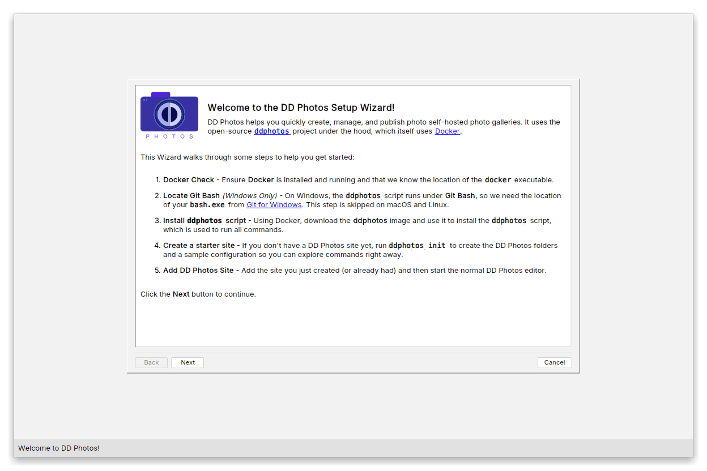
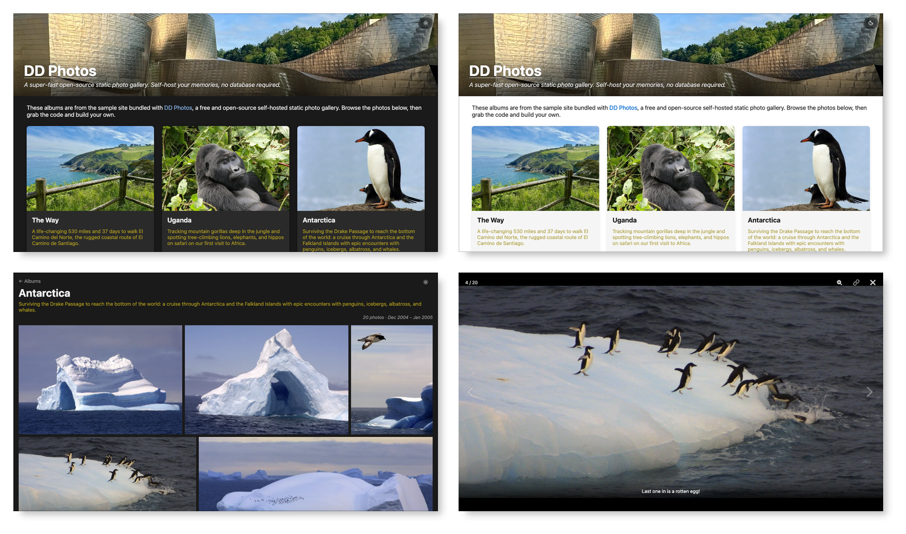

# DD Photos Desktop App

[](https://ddphotos.donohoe.info)
[](https://github.com/dougdonohoe/ddphotos-app/actions)
[](https://www.gnu.org/licenses/agpl-3.0)


DD Photos is a desktop app for quickly and easily publishing your own beautiful photo albums, like our
[sample site↗](https://ddphotos.donohoe.info).  A DD Photos site is wicked-fast,
mobile friendly, and distraction free.  

Publish for free via [Cloudflare Pages↗](https://pages.cloudflare.com) or [Surge↗](https://surge.sh).  More technical users can self-publish 
via AWS S3 or `rsync`.

The DD Photos app is a front end to the [ddphotos](https://github.com/dougdonohoe/ddphotos)
open-source static photo album site generator. Rather than hand-editing complex configuration
files, DD Photos provides a friendly interface for managing your site and album data.
You can also run all the major `ddphotos` commands to generate, test and deploy your site.



See [Screenshots](docs/SCREENSHOTS.md) for full-size screenshots of each screen.

## Site Overview

A DD Photos [site↗](https://ddphotos.donohoe.info) has a home page, with all of your albums,
and their descriptions. You can easily switch between dark and light themes.  Click/touch an 
album and you see a grid of all photos.  Click/touch a photo to see the full size version and
a caption, if it has one. You can easily swipe between photos (or use arrow keys on a laptop).
It works great on mobile, tablet, and desktop.



## How it Works

The idea is that you already use _something else_ to curate and filter your photos. Maybe it
is Adobe Lightroom Classic (my tool).  Or maybe it is Apple Photos or Google Photos.
It doesn't matter, but once you get a selection of photos that comprise an album,
you export the photos into a folder.  All the photos in a folder make up an album.
It's that simple.

With DD Photos, you define where your albums live in the **Config** tab, and
can specify a name, description and choose your cover photo.  Here, you also define
details about your site, like name, description, optional HTML text and the
hero image.

Once you have defined where your photos live, you use the **Photogen** tab to
run the `photogen` tool, which resizes the photos for web viewing and generates index files that
the web app uses.

That's it.  You can now view your personal photo albums site on your machine using the dev server
started in the **Run** tab.

Once you are satisfied with you site, you generate the full static site on the **Build** tab,
and verify it via the **Serve** tab.

The remaining tabs are used to publish your site.  Use **Export** with **Wrangler** (Cloudflare) or
**Surge** for the simplest path.  Use **Deploy** for total control via `rsync` or AWS S3.

## Installation

See [Releases](https://github.com/dougdonohoe/ddphotos-app/releases) for the latest Mac, Linux and Windows installers.

[](https://www.ej-technologies.com/install4j)
Installers are built by [Donohoe Digital LLC↗](https://www.donohoedigital.com/)
courtesy of a license to ej-technologies'
[excellent multi-platform installer builder, install4j↗](https://www.ej-technologies.com/install4j).
We are grateful that they provided us an open source license.

### Required Software

DD Photos uses the [ddphotos↗](https://github.com/dougdonohoe/ddphotos) command-line
tool to generate, test, and deploy your site. That tool runs inside Docker, so you
need a couple of things installed before DD Photos can do its work. The built-in
Setup Wizard checks for these on first launch and links you to them, but you can
install them ahead of time:

- **[Docker↗](https://www.docker.com/get-started/)** (_all platforms_) — DD Photos runs
  every `ddphotos` command (`photogen`, `run`, `build`, `serve`, etc.) inside a Docker
  container, so Docker must be installed and running. On Mac and Windows, install
  **Docker Desktop**; on Linux, the Docker Engine. Docker must be started before you
  run any commands.

- **[Git for Windows↗](https://git-scm.com/download/win)** (_Windows only_) — the
  `ddphotos` script is a Bash script, so on Windows it runs under **Git Bash**
  (`bash.exe`), which ships with Git for Windows. It is not needed on Mac or Linux,
  which already have Bash. When installing, it is fine to accept all the default
  options.

### Beta Software

The current version of the DD Photos app is beta software and supports the majority of `ddphotos` features.
However, some features aren't available yet.  For example, in the app, you can't currently edit 
passwords, captions, certain deploy settings, or custom CSS.  There may also be bugs.

Support for these features is coming soon. You can still hand-edit the related files as documented in 
the [ddphotos↗](https://github.com/dougdonohoe/ddphotos#documentation) repo, and they will
be used when you run `ddphotos` commands.

## TL;DR Running DD Photos From Source

If you are impatient and just want to run the DD Photos app without
reading all the [developer documentation](README-DEV.md), follow these steps:

1. Clone this repo
2. Install [Java 25↗](https://adoptium.net/temurin/releases/?os=any&package=jdk&version=25)
   and [Maven 3↗](https://maven.apache.org/install.html)
3. Run these commands in the root of this repo

```shell
source ddphotos.rc
mvn-package-notests
ddphotos-app
```

## Developer Notes

For full details on how to build and run DD Photos from source, please see [README-DEV.md](README-DEV.md).

## Copyright and Licenses

Unless otherwise noted, the contents of this repository are
Copyright © 2026 Doug Donohoe.  All rights reserved.

This project is licensed under the [GNU Affero General Public License v3.0](LICENSE.TXT) (AGPL v3).

The "DD Photos" and "Donohoe Digital" names and logos, as well as any images,
graphics, text, and documentation found in this repository (including but not
limited to written documentation, website content, and marketing materials)
are licensed under the [Creative Commons Attribution-NonCommercial-NoDerivatives
4.0 International License (CC BY-NC-ND 4.0)](LICENSE-CREATIVE-COMMONS.TXT). 
You may not use these assets without explicit written permission for any uses not 
covered by this License.

If you'd like to use this project under different terms, contact doug [at] donohoe [dot] info.

## Third Party Licenses and Other Open Source Code

The core architecture of DD Photos was adapted from the 
[DD Poker↗](https://github.com/dougdonohoe/ddpoker) open source project,
which is licensed under the [GNU General Public License v3.0↗](https://www.gnu.org/licenses/gpl-3.0.html) (GPL v3).

DD Photos incorporates other open source code, primarily as Maven dependencies 
(see the `pom.xml` files) but also as bundled resources such as fonts.  These are 
explained in 
[code/photos/src/main/resources/config/ddphotos/help/credits.html](code/photos/src/main/resources/config/ddphotos/help/credits.html) and the licenses 
mentioned therein can be found in the `docs/license` directory.
