# Screenshots

A walkthrough of the DD Photos app, from first-launch setup through the command tabs.

## Setup Wizard — Welcome
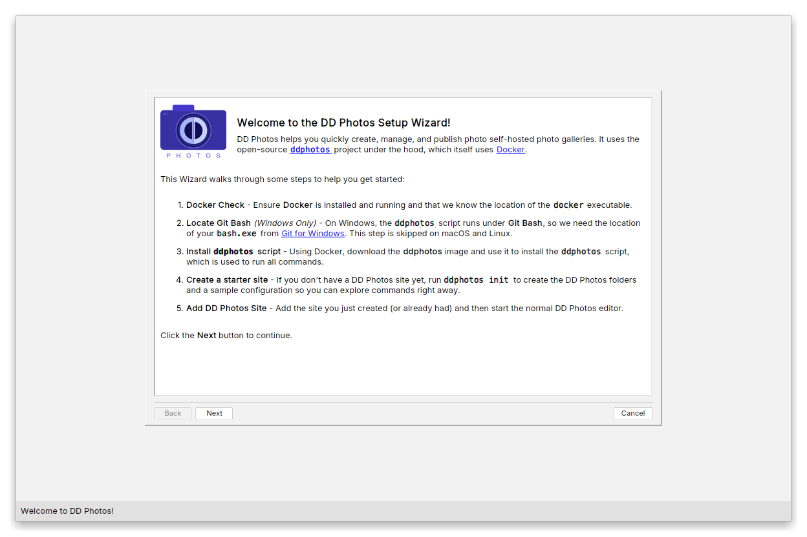

## Setup Wizard — Docker Check
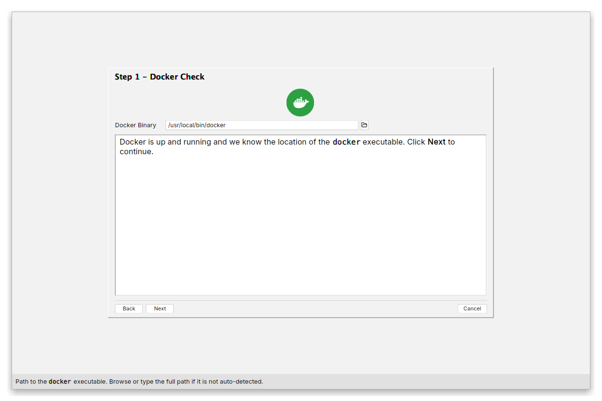

## Setup Wizard — Install ddphotos Script
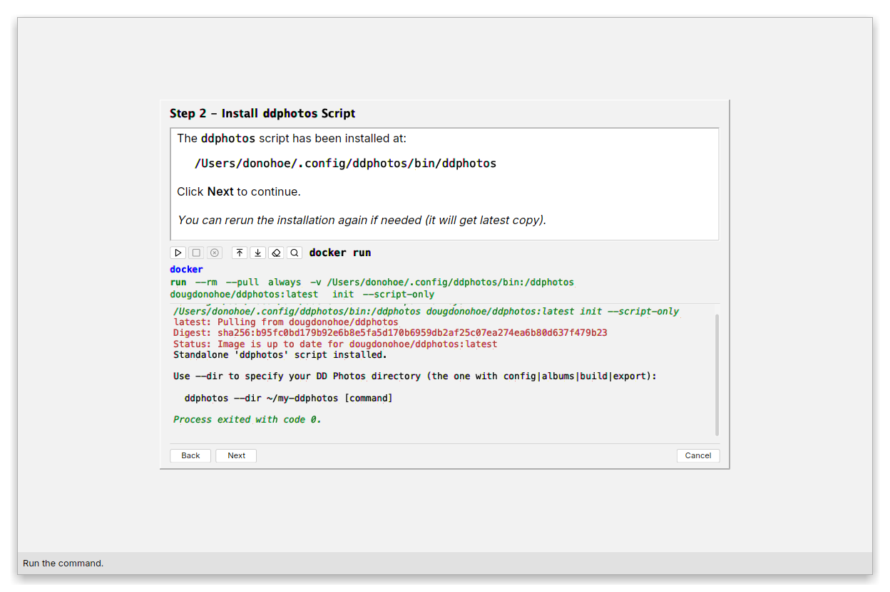

## Setup Wizard — Set Up Your Site
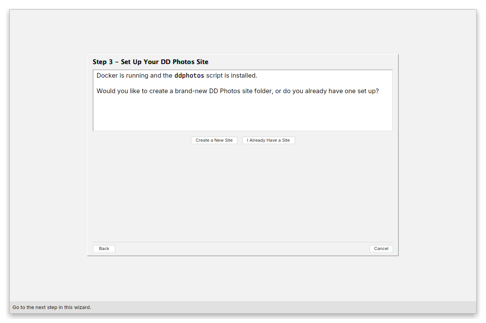

## Setup Wizard — Create Site Folder
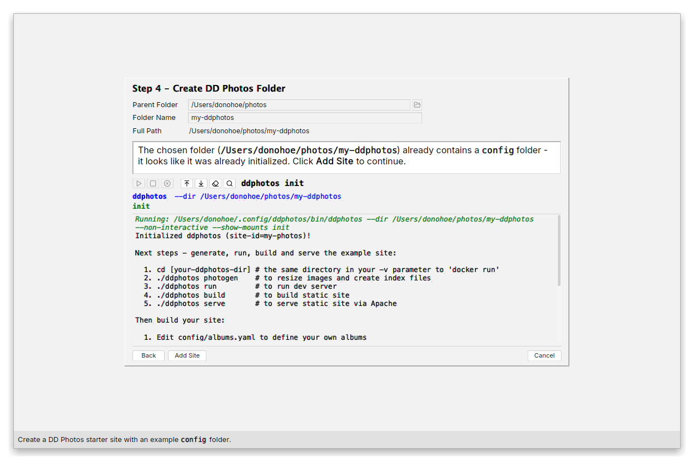

## Config Tab
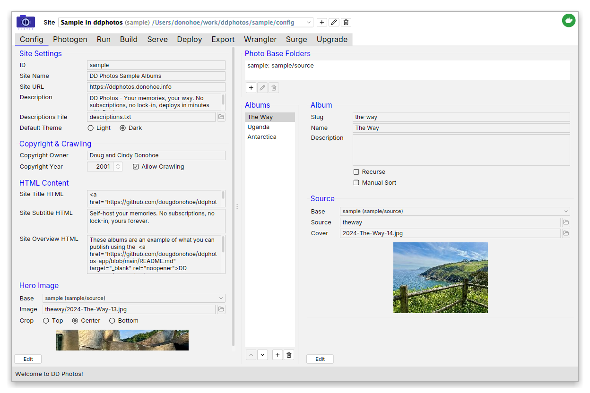

## Photogen Tab
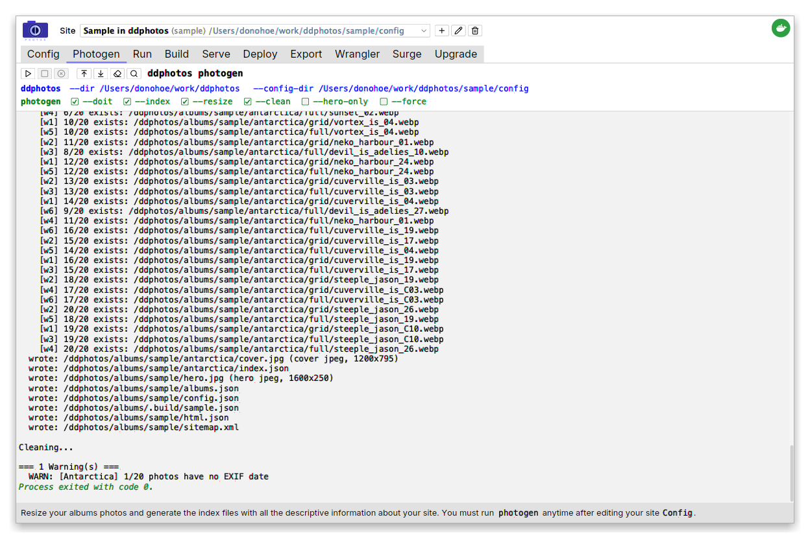

## Run Tab
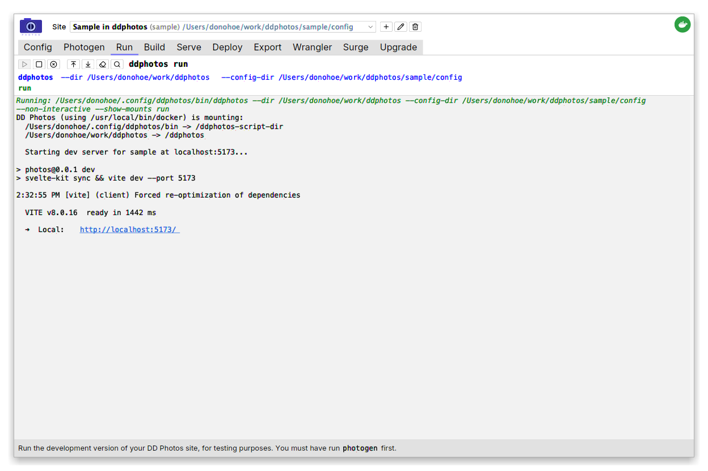

## Build Tab
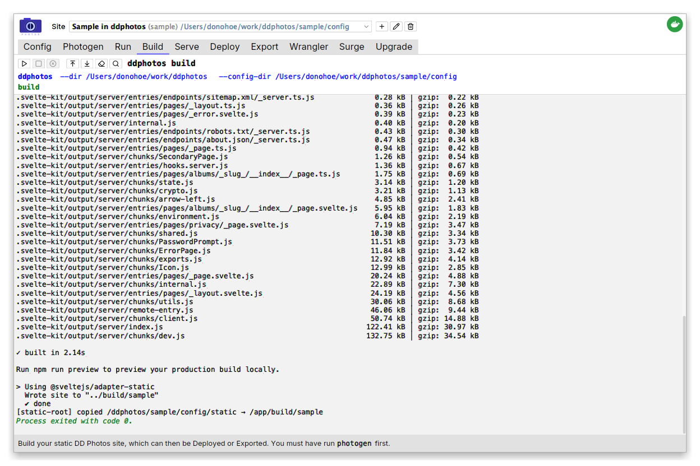

## Serve Tab
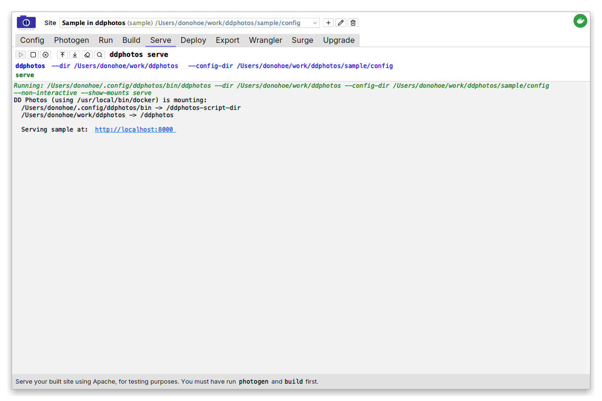

## Deploy Tab
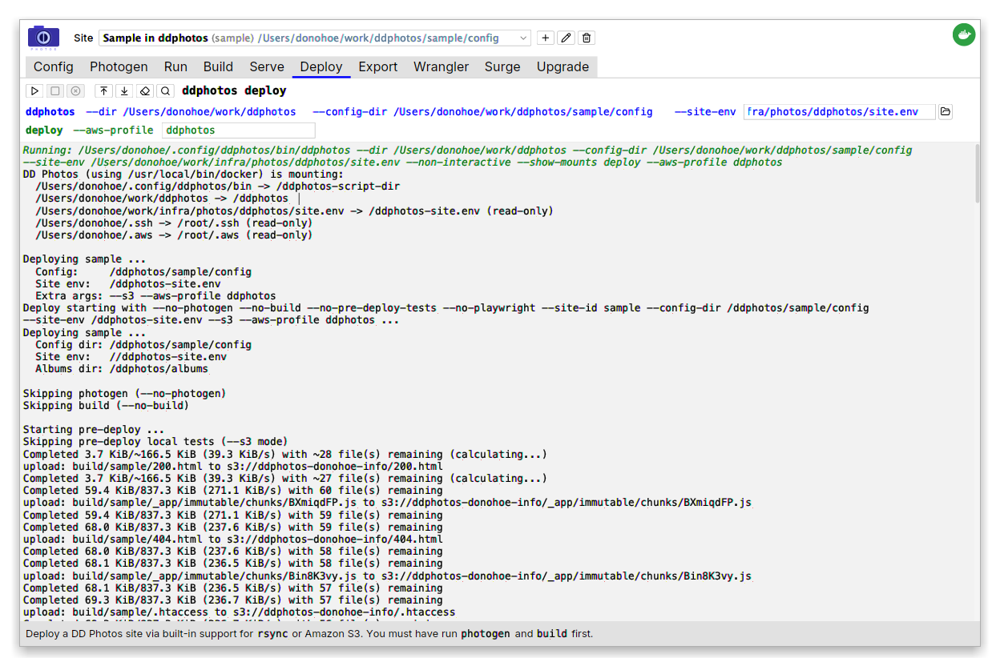

## Export Tab
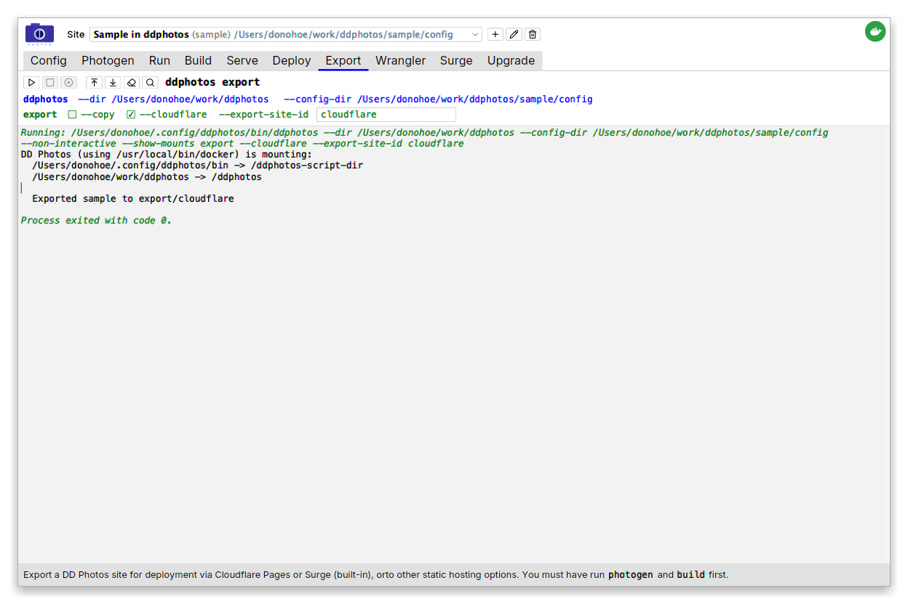

## Wrangler Tab — Cloudflare Pages
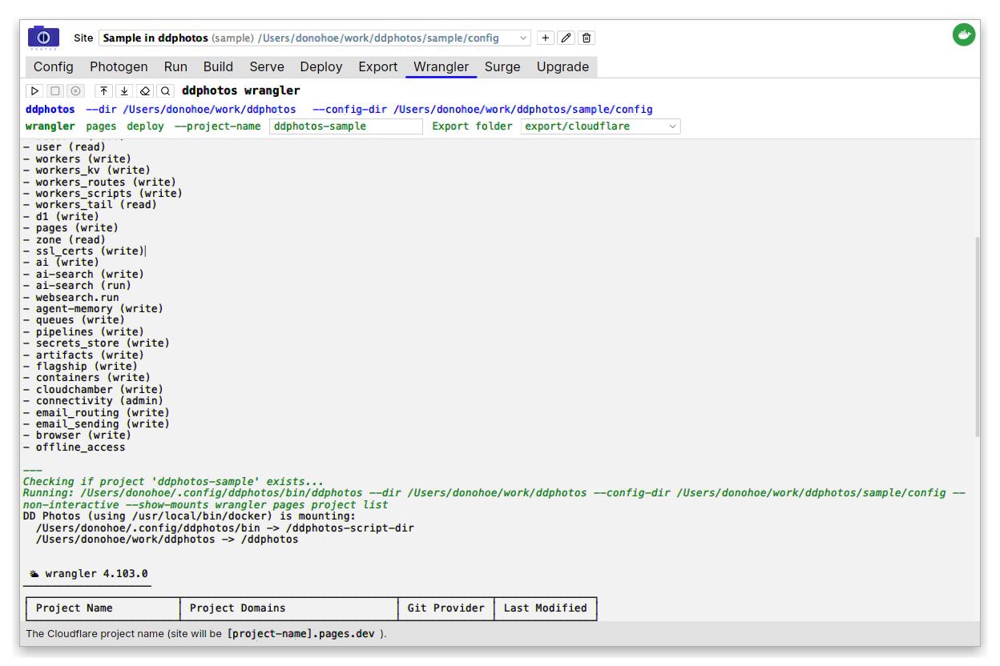

## Surge Tab — Surge.sh
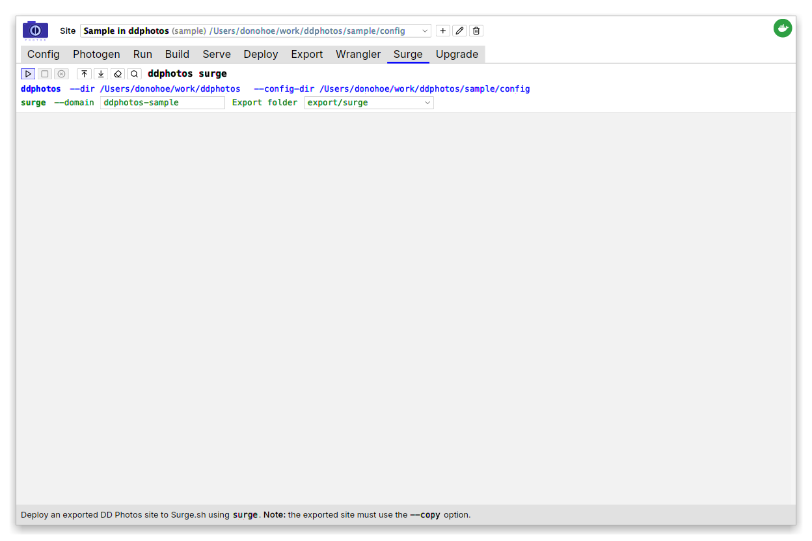

## Upgrade Tab
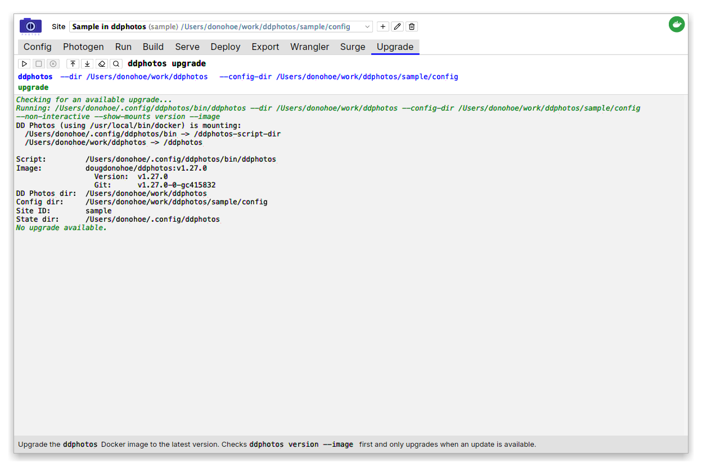
