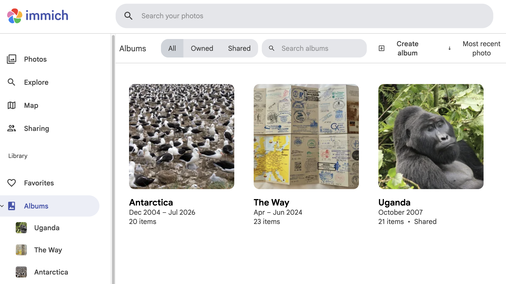
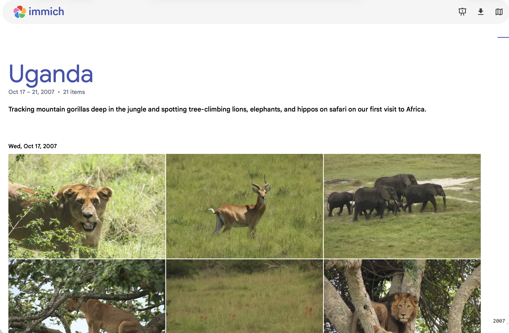
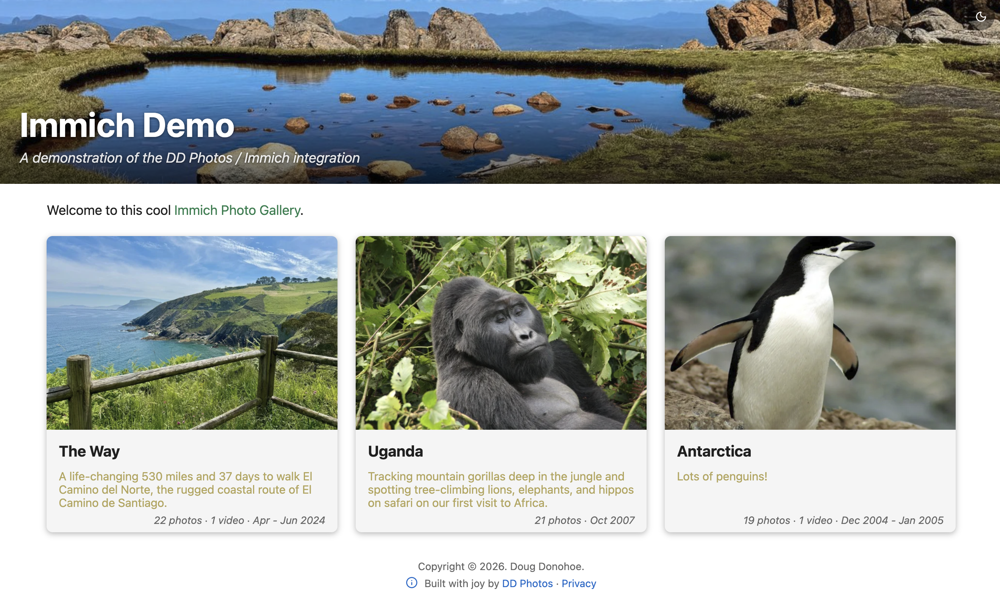
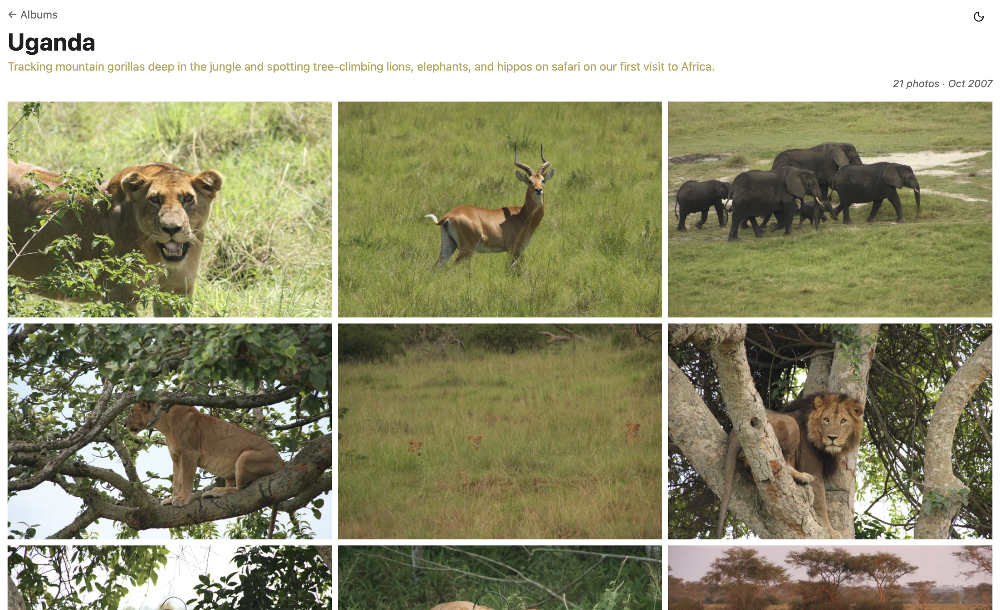
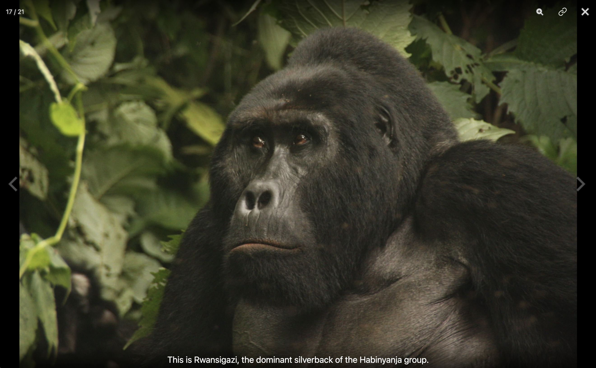
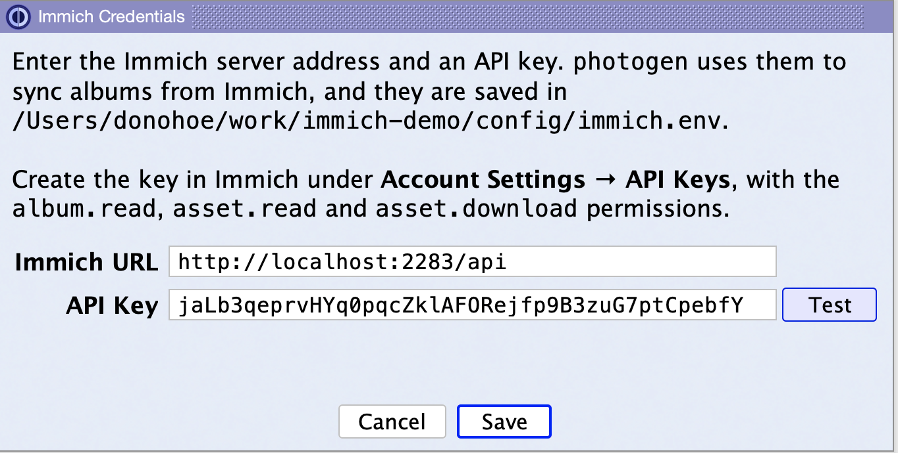
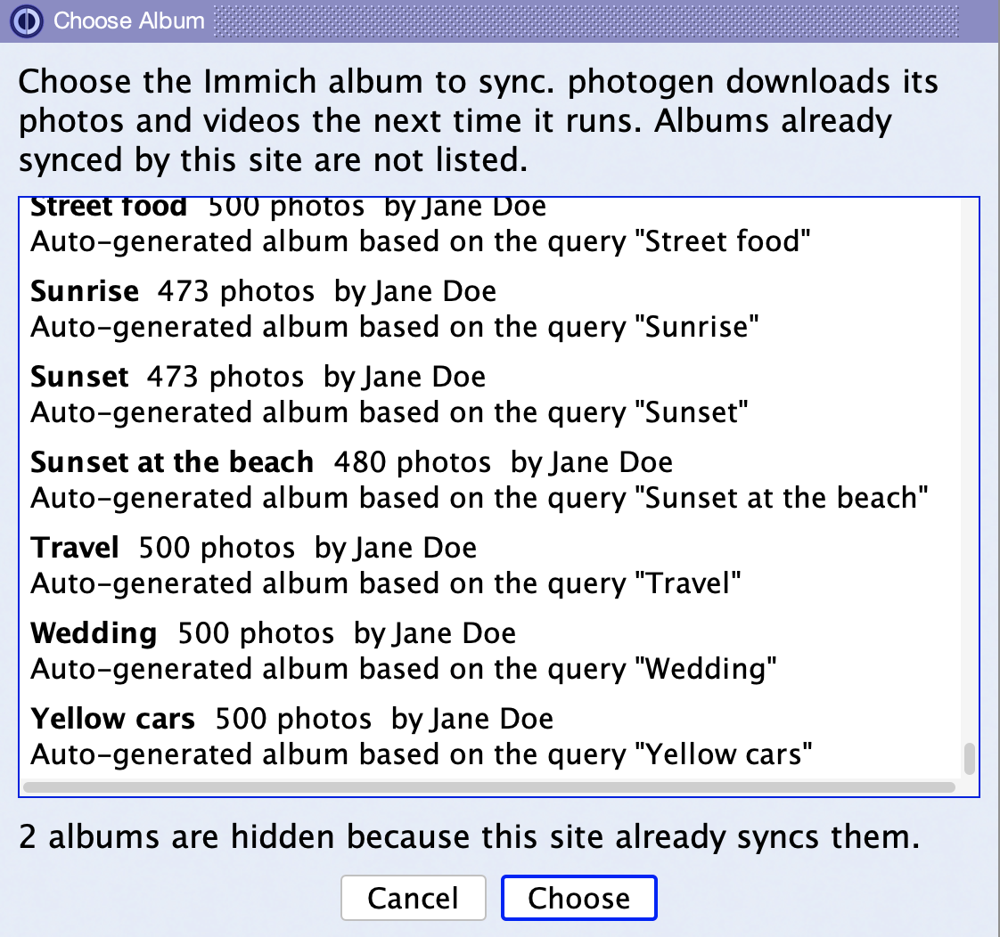
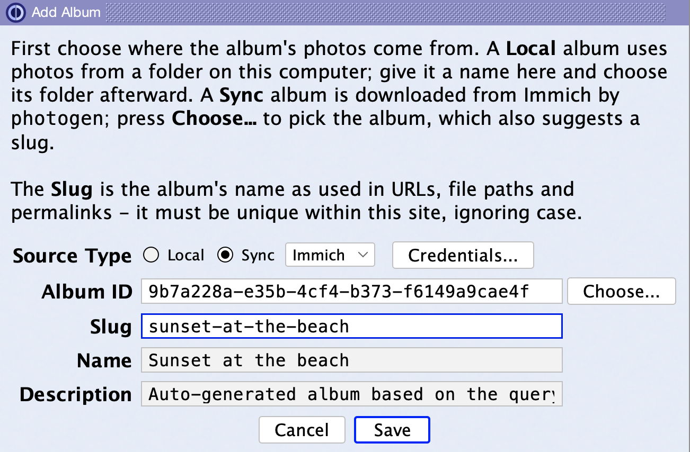
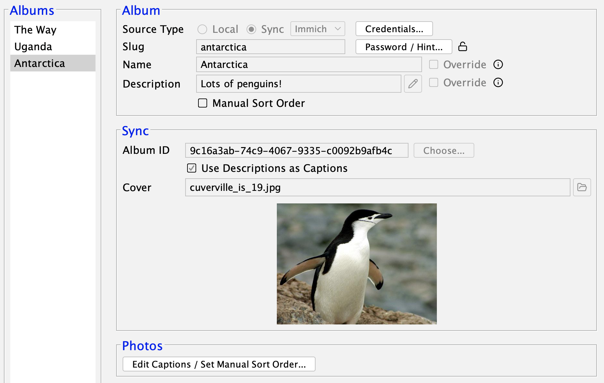

# DD Photos: turn your Immich albums into a fast, static photo site

Hi Immich folks! 👋

I love Immich for keeping my photos. Sharing them has been harder. A shared link shows one album at a
time. Photo descriptions are there, but friends only see them if they open the info panel or start a
slideshow. And the photos stay in date order. Also, the
link only works while my Immich server is up and reachable from the internet.

So I added Immich support to [DD Photos](https://github.com/dougdonohoe/ddphotos-app). DD Photos is a
free, open-source desktop app (Mac, Windows and Linux) that builds a static photo website from your
albums. It now pulls albums straight from Immich, so you don't need to export anything first.

## Start in Immich

Here are three albums in my Immich library:

And here is what a friend sees when I share the Uganda album from Immich:

It works, but it is one album per link, and friends can't browse my other trips.

## End up with a site like this

DD Photos puts all your albums on one home page, each with a cover photo and a description:

Open an album, and you get a clean grid with less white space. It works great on phones and tablets,
and there is a dark theme too.

Tap a photo to see it full size, with its caption. Swipe (or use the arrow keys) to move through the
album. Videos play right in the album too.

The site is just static files. You can publish it for free on
[Cloudflare Pages](https://pages.cloudflare.com) or [Surge](https://surge.sh), or put it anywhere
with `rsync` or AWS S3. Your Immich server can stay private at home. Nobody visiting the site ever
touches it.

See a live example at [ddphotos.donohoe.info](https://ddphotos.donohoe.info).

## How to set it up

**1. Connect to Immich.** Enter your server address and an API key. The key only needs the
`album.read`, `asset.read` and `asset.download` permissions. Press **Test** to check it works.

**2. Add an album.** In the Add Album dialog, choose **Sync** as the source type, then press
**Choose...**. DD Photos lists your Immich albums. Pick one.

DD Photos fills in the album's name and description, and suggests a URL name (the "slug"). Press
**Save**.

**3. Make it yours.** Keep the name and description from Immich, or override them just for your site.
Pick a cover photo. Turn on **Use Descriptions as Captions** to show each photo's Immich description
as its caption. You can also edit captions and set your own photo order, and those changes are kept
the next time you sync.

**4. Build and publish.** Run `photogen` from the app. It downloads your photos and videos from
Immich and resizes them for the web. Later runs only download what is new or changed. Preview the
site on your computer, then publish it.

## A few things to know

- DD Photos downloads the original files. If you edited a photo in Immich, the site shows the
  unedited version, and DD Photos warns you about it.  We plan to add support for edited photos
  in the future.
- RAW files are skipped for now.
- DD Photos runs its build tools in Docker, so you need Docker installed. The app's Setup Wizard
  walks you through it.

## Try it

Download the latest release from the
[releases page](https://github.com/dougdonohoe/ddphotos-app/releases). Questions, ideas and bug
reports are very welcome, either here or on [GitHub](https://github.com/dougdonohoe/ddphotos-app/issues).

Thanks for building Immich. It made this a lot of fun to put together! 📸
