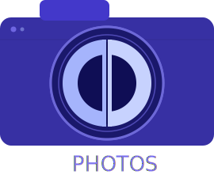

# DD Photos Logo — Export Instructions

## Files
- `ddphotos-logo.svg` — full logo (camera + PHOTOS wordmark), viewBox 270×210
- `ddphotos-icon.svg` — lens monogram only, viewBox 142×142 (use for small sizes)

## How SVG scaling works

SVG is resolution-independent vector — one file renders crisply at any size.
The `viewBox` defines the internal coordinate system; `width`/`height` are just defaults.
To render at any size, override width/height or use CSS.

```html
<!-- In a web page, scale freely: -->
  <!-- 2× -->
        <!-- responsive -->
```

## macOS App Icon (.icns)

macOS requires PNG bitmaps assembled into an `.icns` file.
Export from the SVG using `rsvg-convert` (brew install librsvg):

```bash
# Export PNGs from icon SVG at all required macOS sizes
for size in 16 32 64 128 256 512 1024; do
  rsvg-convert -w $size -h $size ddphotos-icon.svg -o icon_${size}x${size}.png
done

# Also make @2x variants (same pixel count, labeled differently)
cp icon_32x32.png   icon_16x16@2x.png
cp icon_64x64.png   icon_32x32@2x.png
cp icon_256x256.png icon_128x128@2x.png
cp icon_512x512.png icon_256x256@2x.png
cp icon_1024x1024.png icon_512x512@2x.png

# Assemble .icns
mkdir ddphotos.iconset
cp icon_16x16.png      ddphotos.iconset/icon_16x16.png
cp icon_16x16@2x.png   ddphotos.iconset/icon_16x16@2x.png
cp icon_32x32.png      ddphotos.iconset/icon_32x32.png
cp icon_32x32@2x.png   ddphotos.iconset/icon_32x32@2x.png
cp icon_128x128.png    ddphotos.iconset/icon_128x128.png
cp icon_128x128@2x.png ddphotos.iconset/icon_128x128@2x.png
cp icon_256x256.png    ddphotos.iconset/icon_256x256.png
cp icon_256x256@2x.png ddphotos.iconset/icon_256x256@2x.png
cp icon_512x512.png    ddphotos.iconset/icon_512x512.png
cp icon_512x512@2x.png ddphotos.iconset/icon_512x512@2x.png
iconutil -c icns ddphotos.iconset -o ddphotos.icns
```

## Favicon

Modern browsers accept SVG favicons directly:
```html
<link rel="icon" type="image/svg+xml" href="ddphotos-icon.svg">
<!-- Fallback for older browsers: -->
<link rel="icon" type="image/png" sizes="32x32" href="icon_32x32.png">
```

## Java Swing

Load a PNG at the appropriate size (32px or 64px for toolbar/menu, 
128px+ for about dialogs). With the Batik or JSVG library you can 
load the SVG directly:

```java
// Using JSVG (lighter than Batik):
SVGLoader loader = new SVGLoader();
SVGDocument doc = loader.load(getClass().getResource("/ddphotos-icon.svg"));
// Render at any size via SVGPanel or paintIcon()
```

Or just ship `icon_32x32.png` and `icon_128x128.png` as resources.

## Colors (for reference)

| Role              | Hex       |
|-------------------|-----------|
| Camera body       | #3730A3   |
| Viewfinder bump   | #4338CA   |
| Lens barrel       | #1a186b   |
| Lens ring stroke  | #6D68D8   |
| Inner ring        | #4f4ab5   |
| Lens glass        | #0f0e55   |
| Reversed D fill   | #A5B4FC   |
| Normal D fill     | #C7D2FE   |
| PHOTOS wordmark   | #7C72F0   |
