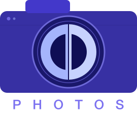

# DD Photos Logo — Export Instructions

## Files
- `ddphotos-logo.svg` — full logo (camera + PHOTOS wordmark), viewBox 270×230
- `ddphotos-icon.svg` — lens monogram only, viewBox 142×142 (use for small sizes)

Both files are self-contained: no fonts, no external references, no transforms.
The PHOTOS wordmark is stored as outlines, so every renderer produces identical
output (verified with both Inkscape and librsvg).

## Geometry

Everything in the lens is concentric — logo on (135,103), icon on (71,71):

| Ring          | logo R | icon R |
|---------------|--------|--------|
| Outer barrel  | 71 (+1.5 half-stroke) | 68 (+1.5) |
| Inner ring    | 61     | 58     |
| Glass         | 55     | 52     |
| DD outer      | 55     | 52     |
| DD counter    | 36     | 34     |

The glass shares the DD's radius, so the monogram sits flush on it and the
counters read as glass showing through.

Each D is a **single circular segment** — the outer disc cut by a vertical chord
at the centre gap — not a semicircle plus a rectangular stem. The stem falls out
as the band between the counter chord and the gap chord, and terminates on the
outer arc, so the silhouette curves continuously at the top and bottom instead
of ending in a flat cap. Arc endpoints are `cy ± sqrt(R² − dx²)` where `dx` is
the chord's offset from the centre; all four sweeps are under 180°, so
`large-arc-flag` is 0 throughout.

## Regenerating the PHOTOS wordmark

The wordmark is Helvetica Neue Medium 26px, `textLength=220` (wide tracking),
baseline y=216.44, ink box x 26.417..243.583 centred on x=135.

The logo viewBox is 270×**230** even though the ink stops at y≈216.9. That band
is not slack — it is the bottom margin, sized to match the gap between the
camera body and the wordmark (13.43 above, 13.12 below). Do not trim it.

To rebuild the outlines:

1. Put the original `<text>` element alone in a scratch SVG (do *not* run
   `object-to-path` over the whole logo — it would convert the readable
   `<rect>`/`<circle>` primitives too).
2. `inkscape --export-plain-svg --export-filename=out.svg \
      --actions="select-all;object-to-path;export-do" scratch.svg`
3. Inkscape's `text-anchor` + `textLength` handling leaves the result off-centre,
   so re-centre it explicitly: query the bbox with
   `inkscape --query-id=… --query-x --query-width out.svg`, then add
   `135 − (x + width/2)` to the path's first (and only absolute) coordinate —
   every following command is relative, so that translates the whole glyph set.

## How SVG scaling works

SVG is resolution-independent vector — one file renders crisply at any size.
The `viewBox` defines the internal coordinate system; `width`/`height` are just defaults.
To render at any size, override width/height or use CSS.

```html
<!-- In a web page, scale freely: -->
  <!-- 2× -->
        <!-- responsive -->
```

## macOS App Icon (.icns)

macOS requires PNG bitmaps assembled into an `.icns` file.
Export from the SVG using `rsvg-convert` (brew install librsvg):

```bash
# Export PNGs from icon SVG at all required macOS sizes
for size in 16 32 64 128 256 512 1024; do
  rsvg-convert -w $size -h $size ddphotos-icon.svg -o icon_${size}x${size}.png
done

# Also make @2x variants (same pixel count, labeled differently)
cp icon_32x32.png   icon_16x16@2x.png
cp icon_64x64.png   icon_32x32@2x.png
cp icon_256x256.png icon_128x128@2x.png
cp icon_512x512.png icon_256x256@2x.png
cp icon_1024x1024.png icon_512x512@2x.png

# Assemble .icns
mkdir ddphotos.iconset
cp icon_16x16.png      ddphotos.iconset/icon_16x16.png
cp icon_16x16@2x.png   ddphotos.iconset/icon_16x16@2x.png
cp icon_32x32.png      ddphotos.iconset/icon_32x32.png
cp icon_32x32@2x.png   ddphotos.iconset/icon_32x32@2x.png
cp icon_128x128.png    ddphotos.iconset/icon_128x128.png
cp icon_128x128@2x.png ddphotos.iconset/icon_128x128@2x.png
cp icon_256x256.png    ddphotos.iconset/icon_256x256.png
cp icon_256x256@2x.png ddphotos.iconset/icon_256x256@2x.png
cp icon_512x512.png    ddphotos.iconset/icon_512x512.png
cp icon_512x512@2x.png ddphotos.iconset/icon_512x512@2x.png
iconutil -c icns ddphotos.iconset -o ddphotos.icns
```

## Favicon

Modern browsers accept SVG favicons directly:
```html
<link rel="icon" type="image/svg+xml" href="ddphotos-icon.svg">
<!-- Fallback for older browsers: -->
<link rel="icon" type="image/png" sizes="32x32" href="icon_32x32.png">
```

## Java Swing

Load a PNG at the appropriate size (32px or 64px for toolbar/menu, 
128px+ for about dialogs). With the Batik or JSVG library you can 
load the SVG directly:

```java
// Using JSVG (lighter than Batik):
SVGLoader loader = new SVGLoader();
SVGDocument doc = loader.load(getClass().getResource("/ddphotos-icon.svg"));
// Render at any size via SVGPanel or paintIcon()
```

Or just ship `icon_32x32.png` and `icon_128x128.png` as resources.

## Colors (for reference)

| Role              | Hex       |
|-------------------|-----------|
| Camera body       | #3730A3   |
| Viewfinder bump   | #4338CA   |
| Lens barrel       | #1a186b   |
| Lens ring stroke  | #6D68D8   |
| Inner ring        | #4f4ab5   |
| Lens glass        | #0f0e55   |
| Reversed D fill   | #A5B4FC   |
| Normal D fill     | #C7D2FE   |
| PHOTOS wordmark   | #7C72F0   |
